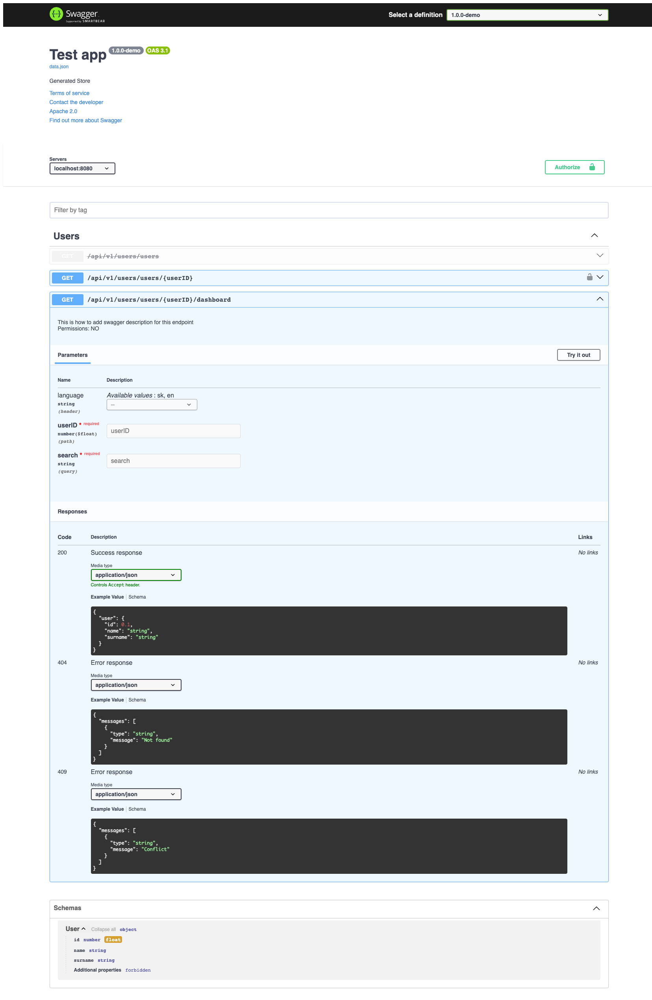

# Welcome to express-joi-to-swagger

## Description
Solution that generates beatiful Swagger API documentation from code. 💻

It lists all of endpoints registred within [app](https://expressjs.com/) with their routes, [methods](https://expressjs.com/en/guide/routing.html), relevant middlewares.

When it comes to generating 📑**Swagger documentation**, you have two options. Generate [Swagger UI](https://swagger.io/tools/swagger-ui/) that can be served as a static file within your application,
or keep documentation as **data.json** file within defined  📁location.

For more information see **Config parameters** bellow ⬇.

This simple tool does not require you to write any more code that necessary. Documentation is generated from source code itself
without using annotations or separate doc files.

## Installation

Use the package manager (*npm* or *yarn*) to install dependencies.

```bash
npm install @goodrequest/express-joi-to-swagger
or
yarn add @goodrequest/express-joi-to-swagger
```

## Requirements
✖ This solution is suitable for everybody who uses [Express](http://expressjs.com/) in a combination with [Joi](https://joi.dev/) to build application's API.
This version was developed and tested on versions 17.x.x of Joi. For version 14.x.x we have parallel branch **v14**. For proper functioning it is also necessary to 
use Typescipt version 3.7.5 and higher. 

✖ As mentioned before, it is not needed to use annotations in your code, however to make this tool works properly you need to
obey some coding practices. You need define at least one [router](https://expressjs.com/en/guide/routing.html) in your application. If you want to include
request and response Joi schemas in a documentation they need to be named the same and exported.

✖ If you are using [middleware](https://expressjs.com/en/guide/using-middleware.html) for user authorization and wish to include
endpoint permissions in the documentation as well you need to name the function responsible for handling this and provide permissions
array as its input parameter.

You can find simple examples of all mentioned in the demo folder of this repository. Quick usage example can also be found below ⬇.


## Config parameters

| Name										| Type   		| Required 			  |Description																			  						|
| ------------------------------------------|-------------|:----------------------:|---------------------------------------------------------------------------------------------------- 			|
| **outputPath**							| string  		|  ✅  | Path to directory where output JSON file should be created. 														                      						|
| **generateUI**							| boolean 		|  ✅  | Whether [Swagger UI](https://swagger.io/tools/swagger-ui/) should be generated.					                                                  						|
| **permissions**							| object  		|  ❌  | Configuration parameters for parsing permissions.
| **permissions**.parser					| function		|  ❌  | Custom parse function for permission middleware
| **permissions**.middlewareName			| string  		|  ✅  | Name of the middleware responsible for handling API permissions.													                              						|
| **permissions**.closure					| string  		|  ✅  | Name of the permission middleware closure. 													                              						|
| **permissions**.paramName					| string  		|  ❌  | Name of the parameter containing permissions passed to middleware.													                              						|
| **permissionsFormatter**					| function		|  ❌  | Custom formatting function for permissions description			|
| **requestSchemaName**						| string  		|  ❌  | Name of the Joi schema object defining request structure.     |
| **responseSchemaName**					| string  		|  ❌  | Name of the Joi schema object defining response structure.     |
| **requestSchemaParams**					| any[]			|  ❌  | Param for ability to pass mock params for requestSchema			|
| **responseSchemaParams**					| any[]			|  ❌  | Param for ability to pass mock params for responseSchema			|
| **errorResponseSchemaName**				| string	    |  ❌  | Name of the Joi schema object defining error responses structure.	 |
| **businessLogicName**						| string  		|  ✅  | Name of the function responsible for handling business logic of the request.     |
| **swaggerInitInfo**						| ISwaggerInit 	|  ❌  | Swagger initial information.      |
| **swaggerInitInfo**.servers				| IServer[] 	|  ❌  | List of API servers     |
| **swaggerInitInfo**.servers.url			| string 		|  ❌  | API server URL      |
| **swaggerInitInfo**.info					| IInfo 		|  ❌  | Basic API information.      |
| **swaggerInitInfo**.info.description		| string 		|  ❌  | API description.      |
| **swaggerInitInfo**.info.version			| string 		|  ❌  | API version.      |
| **swaggerInitInfo**.info.title			| string 		|  ❌  | API title.      |
| **swaggerInitInfo**.info.termsOfService 	| string 		|  ❌  | Link to terms of service.      |
| **swaggerInitInfo**.info.contact			| IContact		|  ❌  | Swagger initial information.      |
| **swaggerInitInfo**.info.contact.email	| string 		|  ✅ | Contact email.      |
| **swaggerInitInfo**.info.license			| ILicense 		|  ❌  | Swagger initial information.      |
| **swaggerInitInfo**.info.license.name		| string 		|  ✅   | License name.      |
| **swaggerInitInfo**.info.license.url		| string 		|  ✅   | License url.      |
| **tags**									| string  		|  ❌  | Configuration parameters for parsing [tags](https://swagger.io/docs/specification/grouping-operations-with-tags/).      |
| **tags**.baseUrlSegmentsLength 			| number  		|  ❌  | Number of base URL segments.      |
| **tags**.joinTags 						| boolean 		|  ❌  | If set to true, array of parsed tags will be joined to string by **tagSeparator**, otherwise array of tags is returned.      |
| **tags**.tagSeparator 					| string  		|  ❌  | String used to join parsed tags.    |
| **tags**.versioning 						| boolean  		|  ❌  | If you are using multiple versions of API, you can separate endpoints also by API version. In this case it is necessary to define param **"baseUrlSegmentsLength"**.     |
| **tags**.versionSeparator 				| string  		|  ❌  | String used to separate parsed tags from API version tag is versioning == true.     |


## Usage example

```Typescript
// imports
import getSwagger from '@goodrequest/express-joi-to-swagger'
import path from 'path'
import app from './your-path-to-express-app'

// Config example
const config: IConfig = {
	outputPath: path.join(__dirname, 'dist'),
	generateUI: true,
	permissions: {
		middlewareName: 'permission',
		closure: 'permissionMiddleware',
		paramName: 'allowPermissions'
	},
	requestSchemaName: 'requestSchema',
	requestSchemaParams: [mockFn],
	responseSchemaName: 'responseSchema',
	errorResponseSchemaName: 'errorResponseSchemas',
	businessLogicName: 'businessLogic',
	swaggerInitInfo: {
		info: {
			description: 'Generated Store',
			title: 'Test app'
		}
	},
	tags: {}
}

// Use case example
function workflow() {
	getSwagger(app, config).then(() => {
		console.log('DONE')
	}).catch((e) => {
		console.log('ERROR', e)
	})
}

// Start script
workflow()
```


Middlewares and router implementation.
```Typescript
router.get(
		'/users/:userID',
		
		// permissionMiddleware
		permissionMiddleware(['SUPERADMIN', 'TEST']),
		
		validationMiddleware(requestSchema),
		
		// businessLogic
		businessLogic
	)

//permissions middleware implementation
export const permissionMiddleware = (allowPermissions: string[]) => function permission(req: Request, res: Response, next: NextFunction) {
	...
}
```

Adding description for endpoints.
```Typescript
const userEndpointDesc = 'This is how to add swagger description for this endpoint'

export const requestSchema = Joi.object({
	params: Joi.object({
		userID: Joi.number()
	}),
	query: Joi.object({
		search: Joi.string().required()
	}),
	body: Joi.object({
		name: Joi.string().required()
	})
}).description(userEndpointDesc)
```

Top level request .alternatives() or .alternatives().try()..
```Typescript
export const requestSchema = Joi.object({
    params: Joi.object(),
    query: Joi.object(),
    body: Joi.alternatives().try(
        Joi.object().keys({
            a: Joi.string(),
            b: Joi.number()
        }),
        Joi.object().keys({
            c: Joi.boolean(),
            d: Joi.date()
        })
    )
})
```
..displays request example as:
```JSON
{
  "warning": ".alternatives() object - select 1 option only",
  "option_0": {
    "a": "string",
    "b": 0
  },
  "option_1": {
    "c": true,
    "d": "2021-01-01T00:00:00.001Z"
  }
}
```

Marking endpoint as deprecated (by adding the @deprecated flag to the beginning of the description in the request schema).
```Typescript
export const requestSchema = Joi.object({
	params: Joi.object({
		userID: Joi.number()
	}),
	query: Joi.object({
		search: Joi.string().required()
	}),
	body: Joi.object({
		name: Joi.string().required()
	})
}).description('@deprecated Endpoint returns list of users.')
```

Using shared schema by calling `.meta` and specifying schema name in `className` property
Shared schemas can be used inside requestSchema body or anywhere in responseSchema or errorResponseSchema

```Typescript
export const userSchema = Joi.object({
	id: Joi.number(),
	name: Joi.string(),
	surname: Joi.string()
}).meta({ className: 'User' })

export const responseSchema = Joi.object({
	user: userSchema
})
```

## Result

Generated SwaggerUI




## Extra Benefits
Swagger bug reports shows inconsistency error in the schema and/or your route definition.

1. In this case the default value is not present in valid values.
```
orderBy: Joi.string().lowercase()
.valid('name', 'duration', 'calories', 'views')
.empty(['', null]).default('order'),
```
2. If you defined id as parameter within route but forgot to define it the schema Swagger will report error.
```
//route with id as parameter

router.put('/:id',
```
schema definition
```
//joi schema that does not include definition for id param

params: Joi.object()
```
## Contribution
Any 👐 contributions, 🐛 issues and 🌟 feature requests are welcome!

Feel free to check following #TODO ideas we have:


| #ID	| Filename	    | Description																				  						|
| ------|:---------------:|-------------------------------------------------------------------------------------------------------- 			|
| #1	|      @all 	| create tests														                      						|
| #2	|      @all		| update to new Open API after release 3.1.0 fix issue https://github.com/OAI/OpenAPI-Specification/pull/2117								                                                  						|
| #3	|      @all  	| sync with branch v14 													                              						|


## Credits
*  [Express endpoint parser](https://github.com/AlbertoFdzM/express-list-endpoints) to retrieve a list of the passed router with the set verbs.
*  [Conversion library](https://github.com/Twipped/joi-to-swagger#readme) for transforming [Joi](https://www.npmjs.com/package/joi) schema objects into [Swagger](https://swagger.io/) schema definitions.
*  A simple [tool](https://github.com/midrissi/func-loc) that help you to retrieve the function location from its reference.
